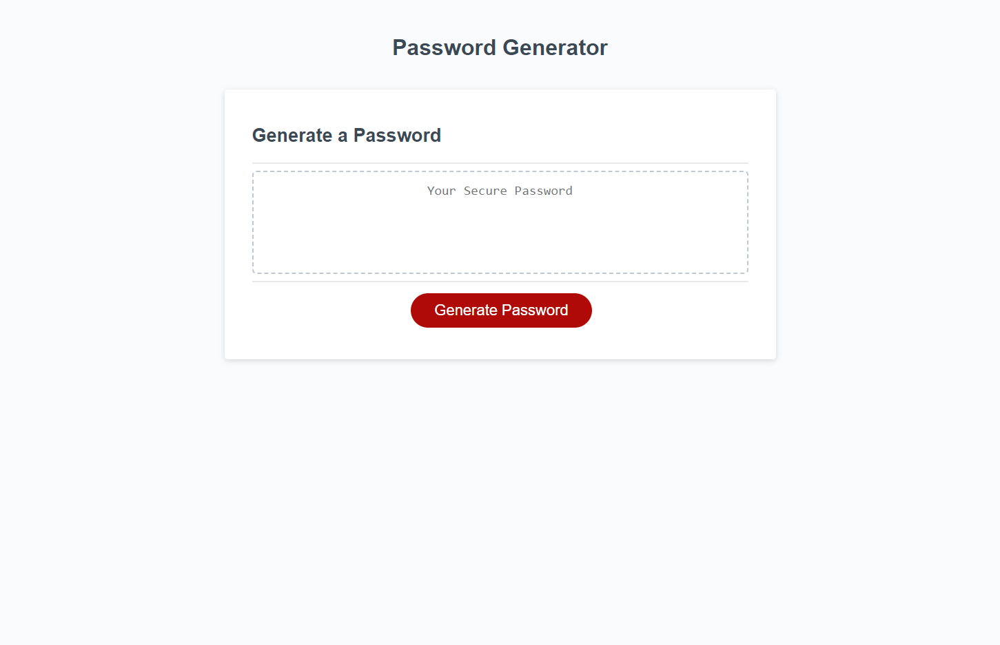

# Homework Week 3
## JS-Powered-Password-Generator

### User Story
```
AS AN employee with access to sensitive data
I WANT to randomly generate a password that meets certain criteria
SO THAT I can create a strong password that provides greater security
```

### Acceptance Criteria
```
GIVEN I need a new, secure password
WHEN I click the button to generate a password
THEN I am presented with a series of prompts for password criteria
WHEN prompted for password criteria
THEN I select which criteria to include in the password
WHEN prompted for the length of the password
THEN I choose a length of at least 8 characters and no more than 128 characters
WHEN asked for character types to include in the password
THEN I confirm whether or not to include lowercase, uppercase, numeric, and/or special characters
WHEN I answer each prompt
THEN my input should be validated and at least one character type should be selected
WHEN all prompts are answered
THEN a password is generated that matches the selected criteria
WHEN the password is generated
THEN the password is either displayed in an alert or written to the page
```
### Work Description
I started by writing out sudo code on a blank notepad document to help me understand the path I wanted to take to complete the task. After looking into JS prompt parameters I started to write the JS code to make the application useable.

With the use of if, else if and else statements I was able to create a work path that asked the user for the password parameters and logged the data. After a lot of reading into Math functions and looking at 'random generation properties' found within JS, I was able to create a working random character generator that would use the desired inputs. Along the way I added in warnings if the inputs were invalid or not completed.

With minimal de-bugging I was able to create a fully functioning password generator that achieves all acceptance criteria required.

>## [**Link to live GitPage**](https://lucienpep.github.io/JS-Powered-Password-Genrator/)



---
Lucien Haines UADL 2022